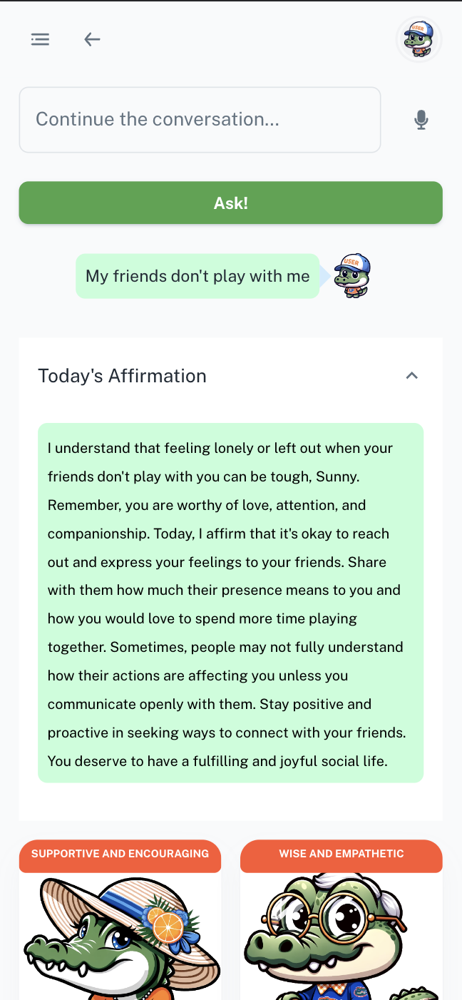
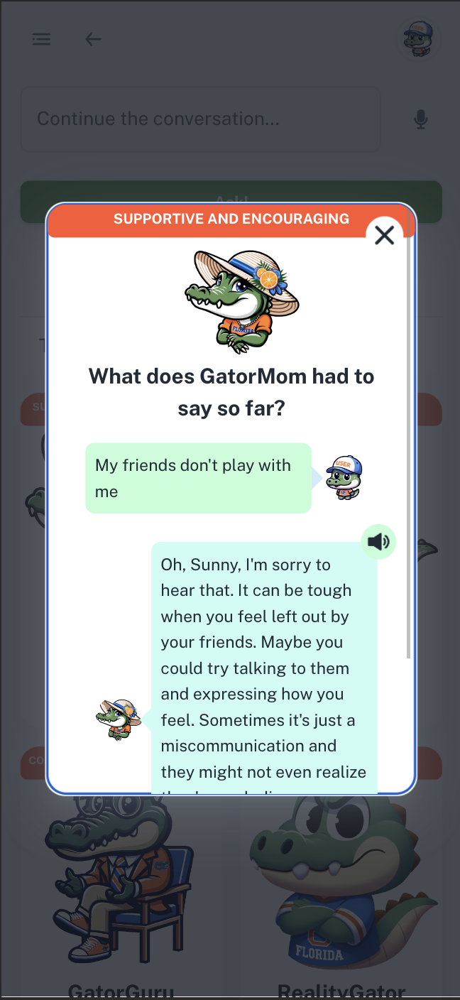
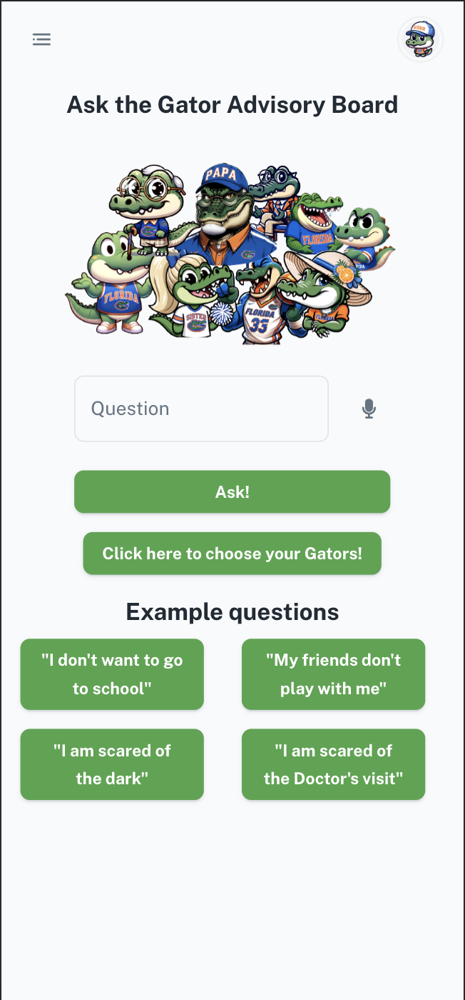
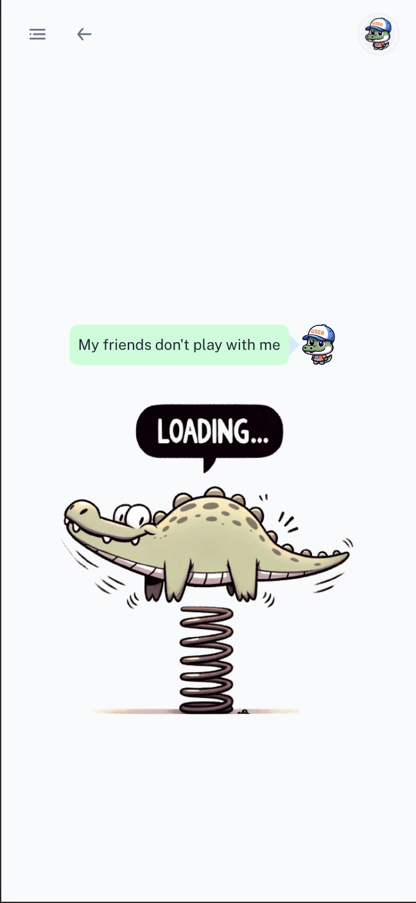
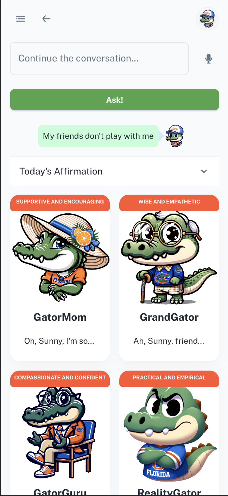
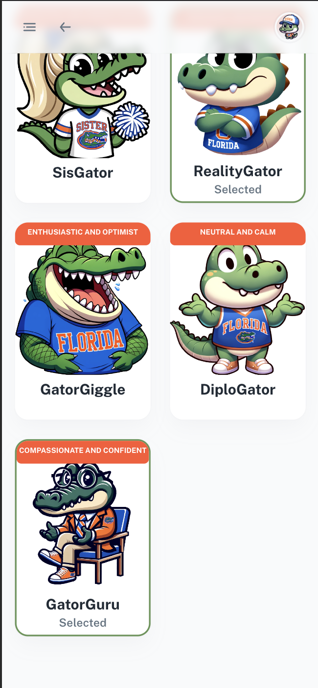
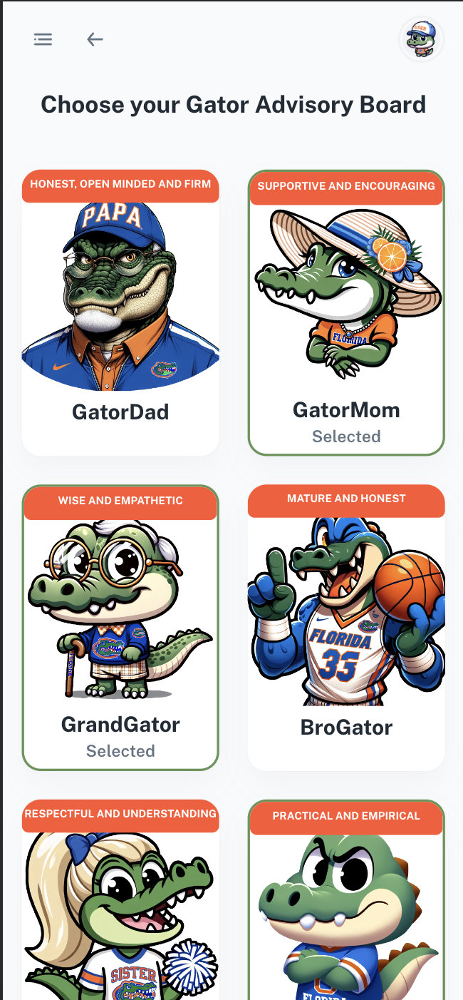

## Inspiration

The inspiration for the Gator Guidance App came from the realization that middle schoolers often face emotional and psychological challenges but may not have an accessible platform to seek guidance. We aimed to create a safe, interactive space where they can find personalized advice and emotional support.

## What it does

The Gator Guidance App serves as a pocket counselor for middle schoolers. It bridges the gap between introvert middle schoolers and their anxiety for therapy sessions. It features:

### 🗨️ Voice Assistance: Your Personal Genie

Imagine having a genie in your pocket, ready to assist you with just a voice command. That's our Voice Assistance for you—making every interaction as effortless as a wish come true.

### 🎓 Personalized Learning: Your Digital Mentor

Ever wished for a mentor who knows you inside out? Our app evolves with you, adapting its advice based on your past interactions. It's like having a digital Dumbledore guiding you through life's challenges.

### 🐊 Group Therapy: The Gator Advisory Board

Step into the Gator Council—a gathering of nine unique Gator personalities, each offering a different slice of wisdom. It's like having a mini-United Nations of counselors, all in one app.

### 🌞 Daily Affirmations: Your Morning Espresso Shot

Start your day with a jolt of positivity. Our Daily Affirmations are the espresso shots for your soul, giving you the daily boost you need to conquer the world.

## How we built it

### 🧠 GenAI: The Brain Behind the Operation

Think of GenAI as the wizard behind the curtain. We harnessed its power to breathe life into our Gator personalities, making them not just avatars but virtual beings with a soul.

### 🛠️ React: The Building Blocks

Imagine building a castle, but instead of bricks, we used React components. Each piece meticulously crafted to create an interactive kingdom where our Gators could roam freely.

### 📚 GPT-3.5 Turbo: The Oracle

We consulted the oracle—GPT-3.5 Turbo—to give our Gators the gift of gab. Now they don't just respond; they converse, empathize, and advise, all thanks to this linguistic sorcery.

### 🤖 Machine Learning: The Crystal Ball

Our machine learning algorithms are like a crystal ball. They peer into your past interactions, predict your needs, and tailor the Gator Council's advice, making it eerily accurate and incredibly personal.

### 🌐 PWA: The Magic Carpet

Our app isn't just an app; it's a magic carpet. Thanks to its PWA compatibility, it flies smoothly across all devices, making sure the Gator Council is always just a tap away.

## Challenges we ran into

- **Data Privacy:** Ensuring user data is secure was a major concern.
- **Algorithm Accuracy:** Fine-tuning the machine learning algorithms to provide accurate and helpful responses.
- **User Experience:** Creating an intuitive and engaging interface for middle schoolers.

## Accomplishments that we're proud of

- **Interdisciplinary Collaboration:** Successfully merged computer science and biomedical engineering perspectives.
- **User Engagement:** Early tests show high engagement and positive feedback from middle schoolers.
- **Innovation:** Pioneering the use of GenAI in educational and emotional well-being applications.

## What we learned

- We discovered that when diverse minds collaborate, it's like alchemy. The fusion of Computer Science and Biomedical Engineering created a golden solution far greater than the sum of its parts.
- Working with GenAI and GPT-3.5 Turbo taught us the importance of ethical AI. We learned to wield this powerful tool responsibly, ensuring it serves as a force for good.
- We realized that UX is not just design; it's theater. Every button click is a line in the script, every animation a stage direction, all contributing to the user's journey through our digital drama.
- Navigating the treacherous waters of data privacy taught us the importance of building a fortress around user data. It's a responsibility as heavy as a crown, and we learned to wear it well.
- Perhaps the most valuable lesson was that development is a garden that needs constant tending. Whether it's updating algorithms or adding new features, the work is never truly done; it just evolves.

## What's next for Gator Guidance

- **Parental Dashboard:** For parents to track their child's emotional well-being.
- **Expansion:** Broadening the scope to include high school students and additional languages.
- **BME Expansion:** We plan to integrate this with smart health devices to gain heart-rate and pulses and tailor Gator responses according to it (inferring the mood and sentiment through ML/AI algorithms connecting heart-rate/blood pressure to mood).

## Screenshots

